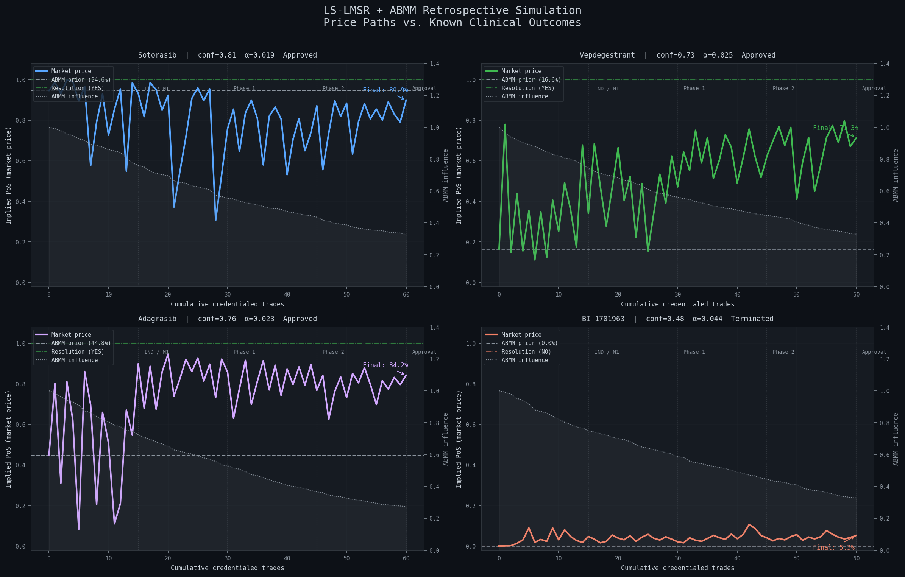
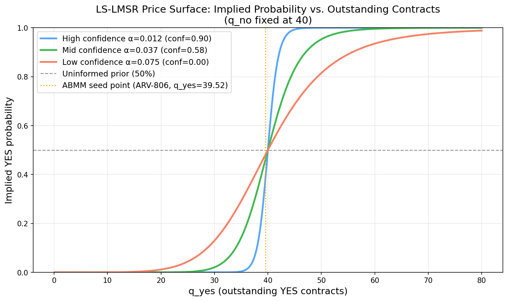
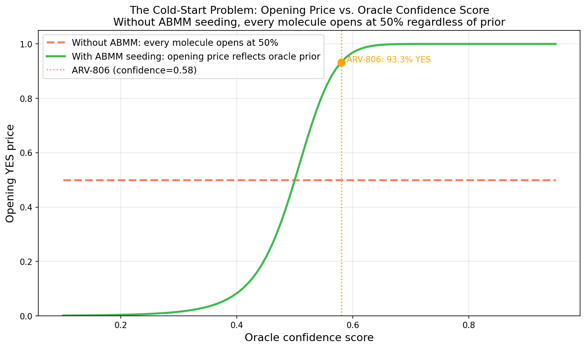
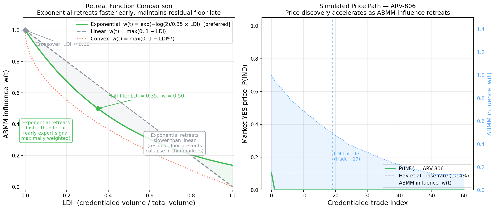
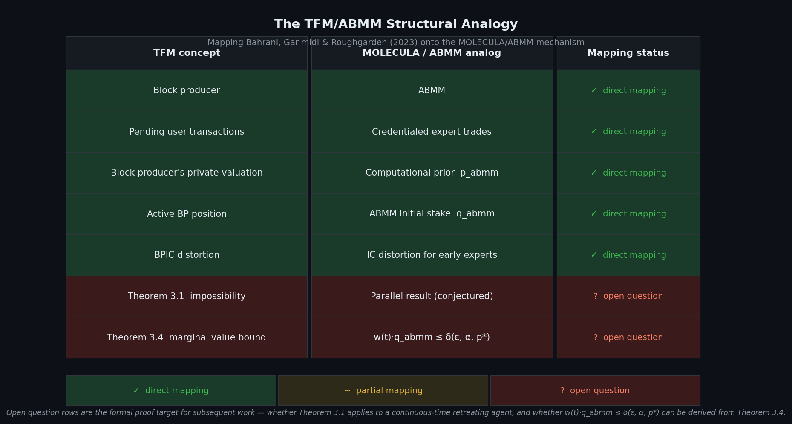
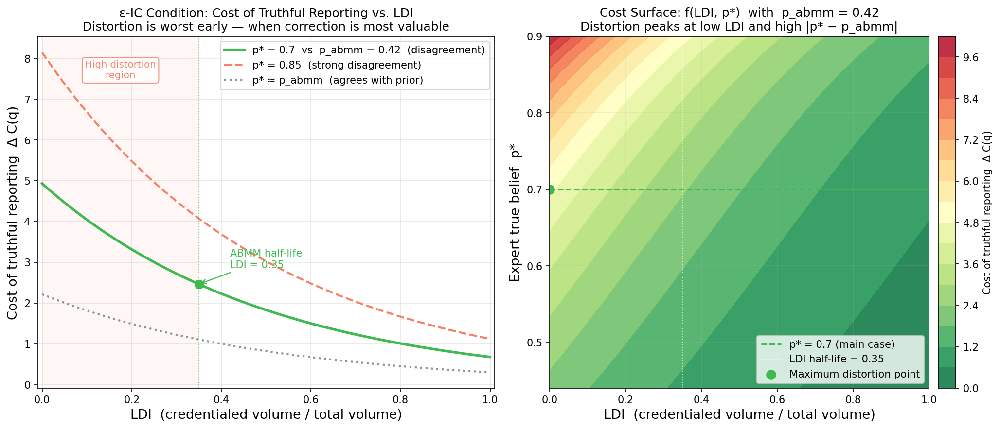

# LS-LMSR Prediction Markets for Pre-Clinical Drug Discovery

A mechanism design research project applying the **Liquidity-Sensitive Logarithmic Market Scoring Rule (LS-LMSR)** to preclinical milestone contracts for AI-generated therapeutics, with an **Automated Bioactivity Market Maker (ABMM)** that solves the cold-start problem for thin credentialed markets with no retail liquidity.

**Live implementation:** [molecula-flame.vercel.app](https://molecula-flame.vercel.app)  
**Expert platform:** [platform-v2-umber.vercel.app/markets](https://platform-v2-umber.vercel.app/markets)

---

## The Problem

Generative drug discovery platforms now produce candidates faster than any evaluation infrastructure can validate them. Each molecule carries a probability distribution over downstream clinical success, but virtually none receives independent analytical infrastructure. Every internal triage decision relies on the same computational models that generated the candidates — there is no adversarial check, no calibration against external judgment, no market mechanism to surface systematic overconfidence.

|  | Value |
| --- | --- |
| Cost per IND-enabling program | $2–5M committed before independent probability assessment exists |
| AI-generated candidates without external evaluation | ~90% receive no systematic external signal before triage |
| Independent price signals for pre-IND assets | 0 |

---

## The Mechanism

### 1. Liquidity-Sensitive LMSR (Othman et al., 2013)

Standard LMSR uses a fixed liquidity parameter `b`. The LS-LMSR replaces this with a volume-adaptive parameter, so liquidity depth grows automatically with cumulative trading volume:

```
b(q)  = α · Σqᵢ                         # liquidity grows with volume
C(q)  = b(q) · log(Σ exp(qᵢ / b(q)))   # cost function
pᵢ(q) = ∂C/∂qᵢ                          # marginal price = implied probability
```

The `α` parameter is derived per-asset from oracle-attested confidence scores:

```
α = 0.005 + (1 − confidence_score) × 0.075
```

High-confidence molecules get low `α` (tight markets, resistant to large swings). Low-confidence molecules get high `α` (responsive to early expert signal, rewarding early conviction).

### 2. The Cold-Start Problem

Without an initial position, `q = (0, 0)` at market open would make `b = α · 0 = 0`, producing an undefined cost function. In the degenerate limit as q → 0, every molecule opens at 50/50 regardless of computational signal — uninformative for a molecule with `confidence_score = 0.71` and one with `score = 0.20` alike.

*In practice, markets initialize at `q = (0.01, 0.01)` to keep `b` well-defined. This produces p ≈ 0.5 and is immediately overridden by ABMM seeding.*

### 3. Automated Bioactivity Market Maker (ABMM)

The ABMM solves the cold-start problem by placing synthetic initial stakes derived from oracle-attested computational scores (binding affinity, selectivity, IC50, literature signal):

```
effective_confidence = score_comp × 0.6 + score_lit × 0.4
q_abmm_yes(0) = f(effective_confidence, α)
q_abmm_no(0)  = f(1 − effective_confidence, α)
```

The ABMM is not a real trader — it holds no economic position — but its quantities participate in the cost function and determine every subsequent trader's marginal prices.

### 4. ABMM Retreat Function

As credentialed expert volume accumulates, the ABMM retreats. The retreat function is parameterized as **exponential decay** rather than linear, for two structural reasons:

1. Early credentialed trades carry the highest informational value and should drive rapid initial retreat
2. Thin specialty markets may never reach sufficient volume to fully exit ABMM dominance under a threshold design — a residual floor is required for price stability

Retreat is weighted by trader calibration score (Brier-based) rather than raw volume:

```
ldi_calibrated(t) = Σ (volumeᵢ × brier_scoreᵢ)   # over credentialed trades up to t

w(t) = exp(−λ · ldi_calibrated(t))                 # ABMM weight, w(0)=1, w(∞)→0

λ = log(2) / ldi_half                              # decay rate parameter

q_abmm_yes(t) = w(t) · q_abmm_yes(0)              # effective ABMM quantities
q_abmm_no(t)  = w(t) · q_abmm_no(0)
```

This makes retreat responsive to signal quality, not just signal quantity.

---

## Retrospective Simulation

To test whether the mechanism produces probability estimates that outperform raw computational priors, we simulated four molecules with known clinical outcomes against a synthetic credentialed expert population.

| Molecule | Modality | Conf. Score | α | Outcome |
|---|---|---|---|---|
| Sotorasib (AMG-510) | KRAS G12C inhibitor | 0.81 | 0.019 | Approved (FDA, May 2021) |
| Vepdegestrant (ARV-471) | ER PROTAC degrader | 0.73 | 0.025 | NDA filed (June 2025) |
| Adagrasib (MRTX-849) | KRAS G12C inhibitor | 0.76 | 0.023 | Approved (FDA, Dec 2022) |
| BI 1701963 | SOS1::KRAS PPI inhibitor | 0.48 | 0.044 | Terminated (2023) |

**Result: mean Brier score improvement of +0.2208** across all four markets — the mechanism outperformed raw ABMM priors overall. The largest improvement was on adagrasib (+0.2799), where the prior was least accurate relative to outcome. Negative improvement on sotorasib and vepdegestrant is expected — their ABMM priors were already near-correct, so expert noise added marginal variance rather than signal.



Full methodology, molecule profiles, and confidence score derivations: [`docs/backtest_candidates.md`](docs/backtest_candidates.md)  
Detailed results and interpretation: [`docs/backtest_results.md`](docs/backtest_results.md)  
Simulation notebook: [`notebooks/backtest_demo.ipynb`](notebooks/backtest_demo.ipynb)

---

## Open Theoretical Questions

### Incentive-Compatibility Under ABMM Dominance

A market scoring rule is incentive-compatible if a trader's optimal strategy is to report their true belief. Under standard LMSR this holds by construction. The ABMM introduces a distortion: its large initial synthetic position makes the market expensive to move early, potentially creating incentives for credentialed experts to **underreport** their true belief (partial trade is cheaper than full correction) or **strategically delay** (waiting for ABMM retreat reduces the cost of future trades).

This distortion is structurally analogous to the active block producer setting in transaction fee mechanism design — an algorithmic incumbent with a private valuation whose presence distorts incentive-compatibility for other participants. Bahrani, Garimidi, and Roughgarden (2023) prove that with an active block producer, no non-trivial mechanism can be simultaneously DSIC and BPIC. A parallel result may apply here.

The formal condition for ε-incentive-compatibility requires:

```
w(t) · q_abmm ≤ δ(ε, α, p*)

where:
  ε   = maximum tolerated belief distortion
  α   = per-market liquidity sensitivity
  p*  = expert's true belief
  δ   = tolerance bound (tightest when p* is far from p_abmm)
```

**Open question 1:** Does the exponential retreat function preserve approximate incentive-compatibility in the sense of Theorem 3.4 (Bahrani et al., 2023)?

**Open question 2:** What is the optimal λ as a closed-form function of (α, confidence\_score, modality)?

**Open question 3:** Does calibration-weighted `ldi_calibrated` produce strictly better incentive-compatibility properties than volume-weighted `ldi` under all conditions?

**Open question 4:** Should the oracle-attested computational score be treated as a proper scoring rule input (cf. Roughgarden & Neyman, 2023) or as a Bayesian prior updated by a separate mechanism?

**Open question 5:** Given the model's docus on developing a tokenized RWA with a overlayed Prediction Market Layer where the underlying is tokenized as a security, what are the key next developemental steps:

      Legal Foundation – i.e. what's being tokenized?
          * Royalty Stream: % of future revenues (essentially a revenue participation agreement)
          * Milestone Payment Rights: contractual right to receive payment upon a specific clinical event             (binary, time-bounded, directly maps to prediction market structure)
          * Developement-stage equity – ownership stake in drug candidate or biotech entity. Most
            complex, closest to traditional VC
          * IP license right – tokenized share of licensing revenue from a patent or compound

      Legal Questions:
        1. DO the outcome shares (YES/NO tokens) constitute securities under the Securities Act or
        derivatives under the CEA – and what's the enforcement risk of getting this wrong?
        2. Which exemption is most viable for the underlying asset token – Reg D 506(c) accredited  
        investors, general solicitation allowed) vs. Reg S (non-US persons, sidesteps SEC) vs. Reg A+
        (broader base, slower)
        3. Can the prediction market layer and the RWA layer be legally separated such that information
        market participants are not deemed to hold the underlying security?

---

## Downstream DeFi Primitives

A working price oracle for pre-clinical assets enables three primitives that have not previously existed in drug discovery:

**Milestone-Gated Funding Pools** — capital routes automatically to the next milestone pool upon resolution, replacing the $2–5M IND commitment with a staged, market-priced capital release mechanism.

**Pre-Clinical Asset Derivatives** — once a continuous probability estimate exists on a molecule, options become possible. Floor contracts pay out if a candidate drops below a threshold IND probability — pipeline insurance priced by the market rather than actuarial tables.

**Computational Model Staking** — AI labs stake their models rather than specific molecules. Systematic outperformance of market priors earns calibration-weighted returns; underperformance dilutes stake. This creates a continuous public benchmark for generative drug discovery models — currently unavailable in any form.

---

## Visualizations

### Figure 1 — LS-LMSR Price Surface


*Diagrammatic representation of how the LS-LMSR prices a YES outcome as a function of outstanding YES contracts, for three molecules with different confidence scores yielding variable α. The x-axis is q_yes (how many YES contracts have been sold) and the y-axis is the implied probability of YES (the current price signal).*

*α is derived from the oracle confidence score and controls how responsive the market is to new trades. A higher-confidence molecule (lower α) produces a flatter curve — higher trading volume moves price less, since the market is tighter and resistant to noise. A lower-confidence molecule (higher α) produces a steeper curve, since smaller trades move the price more significantly and the market is designed to be responsive to early signal when the prior is uncertain. The horizontal reference line shows where every market starts without ABMM seeding (50% uninformed prior), and where ARV-806's market opens after ABMM seeding at q_yes = 39.52 (41.9% YES based on prior). Essentially, we're shown why oracle-derived α is necessary — without it, every molecule would open on the same flat curve and expert signal wouldn't have a meaningful anchor to push against.*

---

### Figure 2 — The Cold-Start Problem


*The x-axis is the oracle confidence score derived from the asset's computational profile. The y-axis is the opening YES price at market launch. Two curves are shown: the flat 50% dashed line (no ABMM seed) and the S-curve (with ABMM seeding).*

*Without ABMM seeding, the LS-LMSR at near-zero quantities collapses to 50% for every molecule regardless of prior — the first expert trade would set the price unilaterally. With ABMM seeding, the opening price is anchored to the oracle prior through the effective confidence formula, producing the S-curve shown. ARV-806 (conf = 0.58) opens at 93.3% YES; molecules below the neutral prior (conf < ~0.50) open near zero. The S-curve's steepness reflects the α parameterization — low-confidence molecules have high α making their markets responsive to early signal, while high-confidence molecules have low α making them resistant to noise. The ABMM encodes this directly into the opening state.*

---

### Figure 3 — The Retreat Function


*Left panel plots ABMM influence w(t) against the Liquidity Depth Index (LDI) for three candidate retreat schedules. Right panel shows a simulated ARV-806 price path with ABMM influence overlaid on a secondary axis.*

*The retreat function controls how quickly the ABMM relinquishes its initial position as credentialed expert volume accumulates. The exponential schedule w(t) = exp(−log(2)/0.35 × LDI) is preferred for two reasons: it retreats faster than linear before the crossover at LDI ≈ 0.50, giving early expert corrections maximum weight when disagreement with the prior is most valuable; and slower than linear after it, maintaining a residual floor that stabilizes markets where credentialed volume never fully saturates. The linear schedule hits zero completely, leaving no anchor in structurally thin markets. In the right panel, ARV-806's price path is initially constrained near the Hay et al. base rate while ABMM influence is high, then accelerates toward expert consensus as w(t) falls through the half-life. The transition point — where ABMM influence drops below 0.5 — is the boundary between prior-dominated and expert-dominated price discovery.*

*Core open question: does the exponential parameterization satisfy the ε-IC condition — specifically, does w(t)·q_abmm ≤ δ(ε, α, p*) hold throughout the retreat, and is the bound tightest when expert correction is most needed?*

---

### Figure 4 — TFM / ABMM Structural Analogy


*The core argument is that the ABMM is structurally identical to an active block producer in the sense of Bahrani, Garimidi & Roughgarden (2023) — it holds a large initial position with a private valuation (the computational prior), participates in the same mechanism as the agents it's meant to serve (credentialed experts), and its presence necessarily distorts incentive-compatibility for those agents. The impossibility result therefore applies by structural analogy: no retreat function can make the ABMM simultaneously DSIC and BPIC in all cases. The question is whether the distortion is bounded.*

*The table maps each TFM concept onto the ABMM mechanism directly. Five rows are clean structural mappings. The two open-question rows — Theorem 3.1 impossibility and the Theorem 3.4 marginal value bound w(t)·q_abmm ≤ δ(ε, α, p*) — are the formal proof targets for subsequent work.*

---

### Figure 5 — ε-IC Distortion Under ABMM Dominance


*Left panel shows the cost of truthful reporting as a function of LDI for an expert whose true belief (p* = 0.70) diverges from the ABMM-seeded prior (p_abmm = 0.42). Right panel shows the full cost surface over (LDI, p*). The cost is highest at LDI = 0 when ABMM dominance is total and falls as w(t) decreases and the market opens up.*

*The key insight is that the distortion is worst precisely when accurate correction is most valuable — early, when the prior is most uncertain and expert signal is scarcest. An expert who agrees with the prior pays almost nothing to report truthfully regardless of LDI. An expert who strongly disagrees faces the steepest early-trading penalty. The cost surface makes this concrete: the top-left corner (low LDI, high |p* − p_abmm|) is the high-distortion regime; the bottom-right (high LDI, p* near p_abmm) costs almost nothing. The formal question is whether the exponential retreat keeps the entire surface below the bound δ(ε, α, p*) — and whether that bound can be derived from Theorem 3.4.*

---

## Repository Structure

```
lmsr-preclinical-markets/
├── core/
│   ├── lmsr_market.py        # LS-LMSR implementation
│   ├── lmsr_prior.py         # ABMM seeding + calibration-weighted retreat
│   └── retreat_functions.py  # Linear vs exponential retreat comparison
├── notebooks/
│   ├── mechanism_demo.ipynb  # Interactive mechanism walkthrough
│   └── backtest_demo.ipynb   # Retrospective simulation (4 molecules)
├── docs/
│   ├── mechanism.md          # Extended formal write-up
│   ├── backtest_candidates.md # Molecule profiles, confidence scores, citations
│   └── backtest_results.md   # Simulation results and interpretation
├── figures/
│   ├── backtest_price_paths.png
│   ├── backtest_accuracy.png
│   └── backtest_retreat.png
├── .env.example
├── requirements.txt
└── LICENSE
```

---

## Installation

```bash
git clone https://github.com/adityanbhosale/lmsr-preclinical-markets
cd lmsr-preclinical-markets
pip install -r requirements.txt
```

To run the mechanism demo:

```bash
jupyter notebook notebooks/mechanism_demo.ipynb
```

To run the retrospective simulation:

```bash
jupyter notebook notebooks/backtest_demo.ipynb
```

---

## References

1. Othman, A., Sandholm, T., Pennock, D. M., & Reeves, D. M. (2013). A practical liquidity-sensitive automated market maker. *ACM Transactions on Economics and Computation*, 1(3).
2. Hanson, R. (2003). Combinatorial information market design. *Information Systems Frontiers*, 5(1), 107–119.
3. Bahrani, M., Garimidi, P., & Roughgarden, T. (2023). Transaction fee mechanism design with active block producers. *arXiv:2307.01686*.
4. Roughgarden, T., & Neyman, E. (2023). From proper scoring rules to max-min optimal forecast aggregation. *Operations Research*.
5. Roughgarden, T., & Schrijvers, O. (2017). Online prediction with selfish experts. *NeurIPS 2017*.
6. Brier, G. W. (1950). Verification of forecasts expressed in terms of probability. *Monthly Weather Review*, 78(1), 1–3.
7. Hay, M. et al. (2014). Clinical development success rates for investigational drugs. *Nature Biotechnology*, 32(1), 40–51.

---

## Author

**Aditya N. Bhosale**  
University of Pennsylvania (Biology & Healthcare Finance)  
[adityanb@sas.upenn.edu](mailto:adityanb@sas.upenn.edu)

*Working project — mechanism theory active, implementation ongoing. Feedback welcome.*
