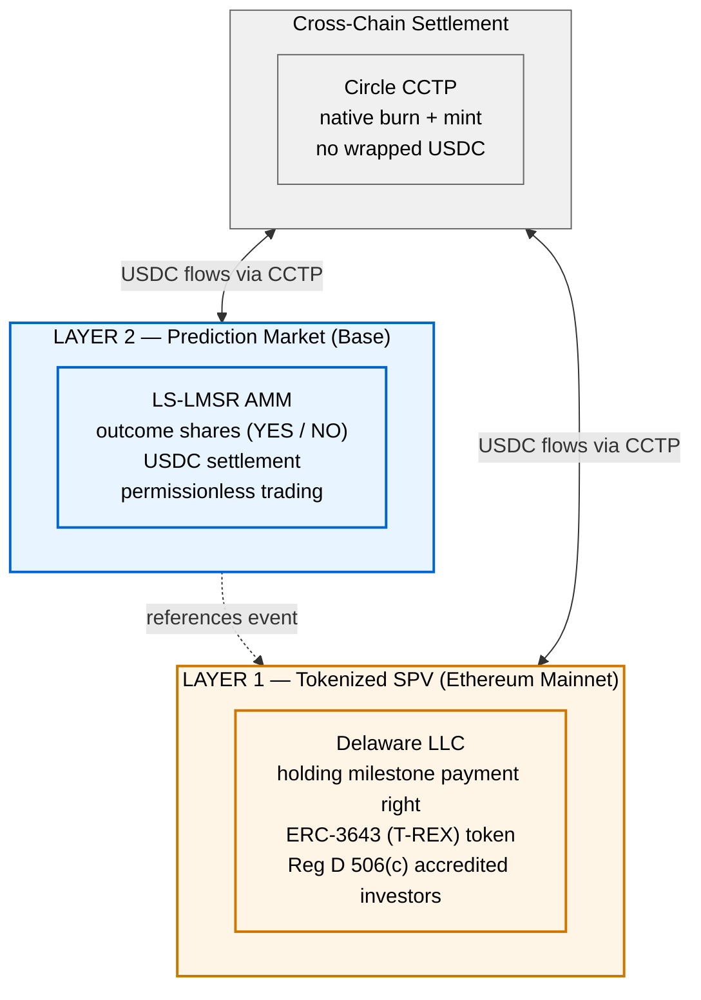

# On-Chain Liquidity and Price Discovery for Tokenized Life Sciences Milestone Payment Rights

A two-layer system for creating liquid secondary markets in contractual biotech milestone payment rights, combining a **Delaware SPV tokenized under Regulation D 506(c)** with a **Liquidity-Sensitive LMSR prediction market** providing continuous price discovery between clinical catalysts.

**Live implementation:** [molecula-flame.vercel.app](https://molecula-flame.vercel.app)
**Expert platform:** [platform-v2-umber.vercel.app/markets](https://platform-v2-umber.vercel.app/markets)
**Legal architecture:** [Tokenized RWA Legal Whitepaper](docs/legal_whitepaper.pdf)
**Testnet reference implementation:** fully deployed on Base Sepolia + Ethereum Sepolia, CCTP outbound leg demonstrated end-to-end. See [Testnet Reference Implementation](#testnet-reference-implementation) below.

---

## The Problem

Clinical-stage private biotechs routinely hold contractual rights to substantial milestone payments — cash flows due from pharma partners upon specific clinical events (FDA approval, Phase II success, regulatory filing). A single milestone payment tied to a Phase II completion can represent $20–100M of contingent value. These rights are **economically significant, legally well-defined, and structurally illiquid**.

The existing market is bilateral and opaque. A biotech seeking to monetize a milestone payment before realization negotiates a one-off sale or loan with a royalty fund (Royalty Pharma, HealthCare Royalty Partners, XOMA) or a specialty lender. Valuation is determined by the counterparty's internal model. There is no secondary market, no continuous price discovery, and no way for the biotech to know whether the quoted price reflects the milestone's true risk-adjusted value or the counterparty's bargaining leverage.

|  | Current State |
| --- | --- |
| Clinical-stage private biotechs with out-licensed milestone payments | ~500–800 companies globally |
| Secondary market for individual milestone payment rights | None |
| Continuous price signal on milestone probability between catalysts | None |
| Counterparty set for non-dilutive milestone monetization | <20 specialty funds |

The result is a structural mispricing of the asset class. Biotechs either accept unfavorable bilateral terms or forgo non-dilutive capital entirely. Royalty funds absorb the illiquidity premium. No institutional price discovery mechanism exists between the deal and the milestone event itself.

---

## The Two-Layer Architecture

This model resolves the illiquidity problem by separating the **legal ownership layer** from the **price discovery layer** and allowing each to operate under the regulatory regime best suited to it. The full legal architecture is documented in the [whitepaper](docs/legal_whitepaper.pdf); this section summarizes the design.



<details>
<summary>ASCII diagram (fallback)</summary>

```
┌─────────────────────────────────────────────────────────────────┐
│                   LAYER 2: PREDICTION MARKET                    │
│                                                                 │
│   LS-LMSR AMM on Base (Coinbase L2)                             │
│   Outcome shares (YES/NO) referencing milestone event           │
│   USDC settlement, continuous price discovery                   │
│   Candidate jurisdiction: CFTC event contract                   │
└───────────────────────┬─────────────────────────────────────────┘
                        │ references
                        ▼
┌─────────────────────────────────────────────────────────────────┐
│                   LAYER 1: TOKENIZED SPV                        │
│                                                                 │
│   Delaware LLC holding milestone payment right                  │
│   ERC-3643 (T-REX) compliance token on Ethereum mainnet         │
│   Regulation D 506(c) — accredited investors only               │
│   Token as authoritative legal record of ownership              │
└─────────────────────────────────────────────────────────────────┘

         ╔═══════════════════════════════════════╗
         ║  CIRCLE CCTP — cross-chain settlement  ║
         ║  USDC native burn + mint between       ║
         ║  Ethereum (L1) and Base (L2)           ║
         ╚═══════════════════════════════════════╝
```
</details>

**Layer 1** is the security. Token holders own membership interests in the SPV, which in turn holds the contractual milestone payment right. The token is the legal record of ownership, not a digital representation of an off-chain claim — the SPV operating agreement designates the on-chain ERC-3643 register as the definitive cap table.

**Layer 2** is the price discovery mechanism. Outcome shares are binary instruments that pay out based on the public milestone event, not on the SPV's economic performance. They are structured as CFTC-style event contracts rather than securities, enabling continuous trading without triggering Reg D transfer restrictions on the underlying SPV token.

**Cross-chain settlement** uses Circle's CCTP rather than a custodial bridge, so USDC on both chains is native Circle-issued rather than a wrapped derivative. The settlement path does not introduce bridge risk as a trust assumption.

The architecture is fully on-chain (**Path B**): compliance is enforced at the token contract level via ERC-3643, not through off-chain middleware. This commits the system to an institutional-grade infrastructure stack (Ethereum mainnet + Base + USDC + Circle CCTP) and leverages the same ERC-3643 standard used by Securitize for BlackRock's BUIDL fund and KKR's tokenized private equity offerings.

The only architectural sub-decision left open is **soulbound vs. composable outcome shares** — whether Layer 2 tokens should be freely transferable (maximizing DeFi composability but risking characterization as an unlawful secondary market in the restricted SPV interest) or soulbound (non-transferable, resolving the Reg D resale question cleanly but eliminating composability). The resolution depends on the SEC vs. CFTC jurisdictional determination discussed in the whitepaper's Section 5.

---

## What's Unique vs. Existing RWA Models

The dominant RWA tokenization platforms today — BlackRock's BUIDL, Ondo Finance, Superstate, Theo.xyz, Backed Finance — collapse legal ownership and trading onto a single layer. They issue a permissioned ERC-3643-style token that *is* the asset, and secondary trading (if it happens at all) occurs on permissioned DEXs or through bilateral OTC. The design works for yield-bearing assets (Treasuries, credit, gold) where continuous cash flows create natural liquidity, but it produces a structural liquidity ceiling for **event-triggered assets** like milestone payment rights.

This project's architecture is designed specifically for the event-triggered case. The table below makes the contrasts explicit:

| Platform | Asset class | Layer structure | Secondary liquidity | Cross-chain |
| --- | --- | --- | --- | --- |
| **BlackRock BUIDL** | Tokenized Treasuries (yield-bearing) | Single layer, Ethereum-only | Permissioned OTC, thin | N/A |
| **Ondo Finance** | Tokenized Treasuries (yield-bearing) | Single layer, multi-chain | Permissioned, weak composability | Multi-chain deploy, no native bridge |
| **Theo.xyz** | Tokenized Treasuries + gold + leveraged strategies | Single layer, Ethereum mainnet only | Permissioned composability within Theo stack | Sidestepped via single-chain concentration |
| **Securitize** | Multi-asset tokenization platform | Single layer (ERC-3643) | Permissioned, fund-specific | Per-asset deploys |
| **Polymarket** | Event contracts (permissionless) | Single layer (L2 only) | Liquid for top events, thin elsewhere | N/A (single chain) |
| **This project** | Milestone payment rights (event-triggered) | **Two layers — permissioned L1 + permissionless L2** | **Layer 2 provides continuous price discovery with natural counterparty structure from hedgers + speculators + LPs** | **Circle CCTP native, no wrapped derivatives** |

The core differentiation is that **compliance is placed only where it structurally has to be** (Layer 1, where legal ownership of the restricted security lives), and **permissionless composability is preserved on Layer 2** (where the traded instrument is an event contract, not a security). No existing platform operates across this separation.

Specifically:

- **BlackRock, Ondo, Superstate** have chosen yield-bearing assets where the single-layer design works well. Their TVL proves their model for that asset class; it doesn't address event-triggered assets.
- **Theo.xyz** is the most sophisticated single-layer design — "past-tokenization" liquidity via lending, leverage, and composability on Ethereum mainnet. The cost is that their entire composability stack is permissioned, not DeFi-composable with Aave or Uniswap.
- **Securitize and Tokeny** provide the ERC-3643 infrastructure layer that Layer 1 uses. They don't opine on what sits above the compliance layer; they provide the substrate.
- **Polymarket and Kalshi** have the Layer 2 half (event contracts with continuous price discovery) but no Layer 1 institutional asset to pair it with. They price external events, not events bearing on a tokenized security.

The dual-layer architecture is what bridges these halves. It is the specific design pattern not served by any existing RWA or prediction market platform.

---

## Layer 1: Tokenized SPV (Security Layer)

The milestone payment right is held by a Delaware limited liability company established as a special purpose vehicle. Token holders own membership interests in the SPV; the SPV holds the contractual right to receive payment from the pharma counterparty upon achievement of the specified clinical milestone.

### Regulatory Structure

The SPV token is a security under Howey. The offering uses **Regulation D Rule 506(c)**, which permits general solicitation of accredited investors and is the near-term structure used by Securitize and comparable institutional tokenization platforms. A parallel Regulation S track is available for non-US participants. Full analysis of the exemption decision and the alternatives (Reg A+, Reg S standalone) is in Section 2 of the whitepaper.

### ERC-3643 (T-REX) Compliance

The SPV membership interest token is implemented using the ERC-3643 standard, which enforces transfer restrictions on-chain through four components:

- **Identity Registry** — maps wallet addresses to verified identity claims (accredited status, jurisdiction, sanctions screening)
- **Compliance Module** — smart contract that checks the identity registry on every transfer and enforces Reg D lock-up periods
- **Token Contract** — the ERC-3643 asset token with transfer hooks calling the compliance module
- **Claims Issuer** — the trusted entity signing identity attestations (SPV administrator or third-party KYC provider)

This architecture satisfies Reg D transfer restrictions without requiring off-chain compliance middleware for every transaction.

### Chain Choice

Layer 1 lives on **Ethereum mainnet** for institutional trust, ERC-3643 ecosystem maturity, and regulatory recognition. Settlement of the underlying milestone payment — when the pharma counterparty pays the SPV upon milestone achievement — is recorded on Ethereum mainnet as a state update to the SPV token contract.

---

## Layer 2: LS-LMSR Prediction Market (Price Discovery Layer)

Between clinical catalysts, the SPV token has no continuous price signal. The prediction market layer solves this by running outcome shares on the milestone event as a separate market on Base, with the price of outcome shares providing a continuous implied probability estimate for the underlying milestone.

### 1. Liquidity-Sensitive LMSR (Othman et al., 2013)

Standard LMSR uses a fixed liquidity parameter `b`. The LS-LMSR replaces this with a volume-adaptive parameter, so liquidity depth grows automatically with cumulative trading volume:

```
b(q)  = α · Σqᵢ                         # liquidity grows with volume
C(q)  = b(q) · log(Σ exp(qᵢ / b(q)))    # cost function
pᵢ(q) = ∂C/∂qᵢ                          # marginal price = implied probability
```

The `α` parameter is derived per-market from a computational prior on milestone probability:

```
α = 0.005 + (1 − prior_confidence) × 0.075
```

High-confidence markets get low `α` (tight markets, resistant to early swings). Low-confidence markets get high `α` (responsive to expert signal, rewarding early conviction).

### 2. The Cold-Start Problem

Without an initial position, `q = (0, 0)` at market open and every market opens at 50/50 regardless of computational signal. A milestone with a well-modeled 75% probability would open identically to one with a 15% probability — uninformative and inviting adverse selection against the first credentialed trader.

### 3. Automated Bioactivity Market Maker (ABMM)

The ABMM solves the cold-start problem by placing synthetic initial stakes derived from an oracle-attested probability model. In the current framing, the prior is a composite signal incorporating the counterparty's proprietary preclinical data, published clinical literature, analyst models where available, and historical base rates for the therapeutic area:

```
effective_prior = p_model · 0.5 + p_literature · 0.3 + p_base_rate · 0.2
q_abmm_yes(0)  = f(effective_prior, α)
q_abmm_no(0)   = f(1 − effective_prior, α)
```

The ABMM is not a real trader — it holds no economic position — but its quantities participate in the cost function and determine every subsequent trader's marginal prices.

The use of counterparty proprietary data in the prior creates a material non-public information (MNPI) exposure addressed in the whitepaper's Section 6. The near-term deployment is restricted to private biotech counterparties, where Rule 10b-5 does not apply; public company onboarding requires a purpose-built information barrier architecture that is an open design question.

### 4. ABMM Retreat Function

As credentialed expert volume accumulates, the ABMM retreats. The retreat function is parameterized as **exponential decay** rather than linear, for two structural reasons:

1. Early credentialed trades carry the highest informational value and should drive rapid initial retreat
2. Thin markets may never reach sufficient volume to fully exit ABMM dominance under a threshold design — a residual floor is required for price stability

Retreat is weighted by trader calibration score (Brier-based) rather than raw volume:

```
ldi_calibrated(t) = Σ (volumeᵢ × brier_scoreᵢ)   # over credentialed trades up to t

w(t) = exp(−λ · ldi_calibrated(t))                # ABMM weight, w(0)=1, w(∞)→0

λ = log(2) / ldi_half                             # decay rate parameter

q_abmm_yes(t) = w(t) · q_abmm_yes(0)             # effective ABMM quantities
q_abmm_no(t)  = w(t) · q_abmm_no(0)
```

This makes retreat responsive to signal quality, not just signal quantity.

The mechanism has been validated empirically against four completed drug development programs (sotorasib, vepdegestrant, adagrasib, BI 1701963), producing a mean Brier score improvement of +0.2208 over flat-prior baseline. See `docs/mechanism.md` for the full backtest methodology.

### 5. Settlement and Cross-Chain Flow

Layer 2 lives on **Base** for low transaction costs and USDC-native infrastructure. When a prediction market resolves, USDC distributions to outcome share holders execute natively on Base. When the underlying SPV milestone payment is settled, the legal finality is recorded on Ethereum mainnet via the ERC-3643 token contract; USDC moves cross-chain via **Circle's Cross-Chain Transfer Protocol (CCTP)**.

---

## Testnet Reference Implementation

**Live demo:** `<https://dual-layerbiotechliquidity.vercel.app/>` — connect a wallet on Base Sepolia and trade against the live LS-LMSR market. No setup required. Source in [`frontend/`](frontend/).

**Repository structure:** Layer 1 + Layer 2 contracts in [`contracts/`](contracts/), Next.js demo in [`frontend/`](frontend/), full deployment + reproducibility docs in [`docs/`](docs/).

A working Solidity implementation of the full dual-layer architecture is deployed across Ethereum Sepolia (Layer 1) and Base Sepolia (Layer 2), with Circle CCTP connecting the two. All contracts are verified on their respective block explorers and reproducible from the `contracts/` subdirectory via Foundry.

### Key deployment coordinates

| Component | Network | Address | Verified |
| --- | --- | --- | --- |
| Layer 2 LSLMSR V3 (USDC-settling AMM with claim) | Base Sepolia | [`0xb7Bd56113438961202EcFF985E7Cb2B9F2442475`](https://sepolia.basescan.org/address/0xb7Bd56113438961202EcFF985E7Cb2B9F2442475) | ✓ |
| Layer 1 MilestoneRegistry (ERC-3643 four-token ladder) | Ethereum Sepolia | [`0x1488cB83Dc15E677FFd2b5C1010a56a0C7cCa14D`](https://sepolia.etherscan.io/address/0x1488cB83Dc15E677FFd2b5C1010a56a0C7cCa14D) | ✓ |
| CCTP outbound demo (Sepolia → Base Sepolia burn tx) | Ethereum Sepolia | [`0xb5d51882a2a26fe24d38785709022d762475d84d4e0e2ff84dea1d144baa6452`](https://sepolia.etherscan.io/tx/0xb5d51882a2a26fe24d38785709022d762475d84d4e0e2ff84dea1d144baa6452) | — |
| Live demo (Next.js + wagmi + RainbowKit) | Vercel | `<https://dual-layerbiotechliquidity.vercel.app/>` | — |

Full deployment coordinates, architecture notes, and roadblock documentation are in [`docs/testnet-implementation.md`](docs/testnet-implementation.md). CCTP demo walkthrough with all transaction hashes is in [`docs/cctp-demo.md`](docs/cctp-demo.md).

### Component summary

**Layer 2 — LSLMSR V3** (`contracts/src/LSLMSR.sol`)

- LS-LMSR cost function with PRBMath UD60x18 fixed-point for `exp` / `ln` operations
- Per-trader position tracking (`mapping(address => Position)`)
- USDC settlement via ERC-20 `transferFrom` pull model
- Solvency guarantee: `resolve()` reverts unless contract holds ≥ 1 USDC per winning share
- Proportional payout via pull-model `claim()` — winners receive `(their shares / total winning shares) × pool balance`
- `depositLiquidity()` for pre-resolution liability top-ups

Three iterated versions (V1 → V2 → V3) progressed from pure cost function (V1, 14 tests) to position tracking (V2, 21 tests) to full USDC settlement + claim (V3, 32 tests).

**Layer 1 — Minimal T-REX suite** (`contracts/src/layer1/`)

Five coordinated contracts implementing a simplified ERC-3643 permissioned security token standard:

- `ClaimTopicsRegistry.sol` — registers required claim topics (MVP: `ACCREDITED_INVESTOR`)
- `IdentityRegistry.sol` — investor registration + issue/revoke claim lifecycle
- `Compliance.sol` — "both parties verified" transfer-gating module
- `MilestoneToken.sol` — ERC-3643 token with mint/burn/transfer compliance hooks
- `MilestoneRegistry.sol` — four-token ladder (IND/Phase 1/Phase 2/Approval) under shared identity + compliance infrastructure

Simplifications from full T-REX documented in `docs/testnet-implementation.md`: no separate OnchainID contracts, no TrustedIssuersRegistry (single trusted issuer), simplified compliance rules, no regulatory modifier suite. Interface-compatible with full T-REX; the reference implementation can be swapped in without changing Layer 2.

27 unit tests cover claim topics registration, identity lifecycle, compliance rules (verified-to-verified, revocation, mint/burn edge cases), token transfer gating, and the four-milestone ladder behavior.

**CCTP cross-chain demo** (`contracts/script/cctp/`, `contracts/scripts/cctp_poll.js`)

Four Foundry scripts plus a Node.js attestation poller (ethers v6) implementing a full round-trip: burn USDC on Sepolia → Circle attestation → mint on Base Sepolia → trade on Layer 2 → resolve → claim → CCTP return → final mint on Sepolia.

**Frontend** (`frontend/`)

Next.js 14 (App Router) + wagmi v2 + RainbowKit v2 + Tailwind/shadcn. Built in four phases: (1) provider scaffold with SSR-safe wagmi/WalletConnect wiring, (2) read-only market data with 12-second polling, (3) connected-wallet position tracking + Layer 1 read-only display (cross-chain render), (4) trade form with single-button approve+trade UX.

The frontend is a thin client over the deployed contracts — no indexer, no database, no cached state beyond React Query's in-memory cache. Every value displayed is a fresh `eth_call` on the public RPC. Same credibility property as the contracts themselves: a partner can independently verify any number on the page via `cast` or Etherscan.

Deployed on Vercel; source reproducible via `cd frontend && npm install && npm run dev`.

**Outbound leg is complete on testnet** and fully documented with transaction hashes in [`docs/cctp-demo.md`](docs/cctp-demo.md). The return leg (resolve + claim + CCTP back to Sepolia) is scripted, committed, and deferred pending additional testnet USDC liquidity; resumption steps are in the same doc.

### Test coverage

| Suite | Tests | Covers |
| --- | --- | --- |
| `contracts/test/LSLMSR.t.sol` | 32 | LSLMSR V3: cost function math, position tracking, USDC settlement, solvency check, proportional claim, single/multi-winner scenarios |
| `contracts/test/Layer1.t.sol` | 27 | ClaimTopicsRegistry, IdentityRegistry lifecycle, Compliance rules, MilestoneToken transfer gating, four-token ladder behavior |
| **Total** | **59** | Full Layer 1 + Layer 2 component coverage |

Run from `contracts/`:

```bash
forge test -vv
```

### End-to-end reproducibility

The `contracts/` directory is a self-contained Foundry project. Given a funded deployer wallet (Sepolia ETH + Base Sepolia ETH + Sepolia USDC), the full stack can be redeployed to testnet in ~20 minutes. Deployment commands and expected output are documented in `docs/testnet-implementation.md` and `docs/cctp-demo.md`.

---

## Open Theoretical Questions

### Incentive-Compatibility Under ABMM Dominance

A market scoring rule is incentive-compatible if a trader's optimal strategy is to report their true belief. Under standard LMSR this holds by construction. The ABMM introduces a distortion: its large initial synthetic position makes the market expensive to move early, potentially creating incentives for credentialed experts to **underreport** their true belief (partial trade is cheaper than full correction) or **strategically delay** (waiting for ABMM retreat reduces the cost of future trades).

This distortion is structurally analogous to the active block producer setting in transaction fee mechanism design — an algorithmic incumbent with a private valuation whose presence distorts incentive-compatibility for other participants. Bahrani, Garimidi, and Roughgarden (2023) prove that with an active block producer, no non-trivial mechanism can be simultaneously DSIC and BPIC. A parallel result may apply here, though the ABMM's non-strategic nature (deterministic, publicly known retreat schedule, no preferences) suggests the DSIC-only version of the problem is the correct formulation.

The formal condition for ε-incentive-compatibility requires:

```
w(t) · q_abmm ≤ δ(ε, α, p*)

where:
  ε   = maximum tolerated belief distortion
  α   = per-market liquidity sensitivity
  p*  = expert's true belief
  δ   = tolerance bound (tightest when p* is far from p_abmm)
```

**Open question 1:** Does the exponential retreat function preserve approximate incentive-compatibility in the sense of Theorem 3.4 (Bahrani et al., 2023)?

**Open question 2:** What is the optimal λ as a closed-form function of (α, prior_confidence, modality)?

**Open question 3:** Does calibration-weighted `ldi_calibrated` produce strictly better incentive-compatibility properties than volume-weighted `ldi` under all conditions?

**Open question 4:** Should the oracle-attested probability model be treated as a proper scoring rule input (cf. Roughgarden & Neyman, 2023) or as a Bayesian prior updated by a separate mechanism?

### Legal and Architectural Open Questions

Summarized from the whitepaper's Section 7:

**(a) SEC vs. CFTC jurisdiction over outcome shares.** Whether binary outcome shares referencing a tokenized security fall under SEC or CFTC jurisdiction, and whether the two-layer structure is legally respected or collapsed by regulators into a single securities offering. This is the most significant unresolved legal question in the architecture.

**(b) Soulbound vs. composability.** Whether Layer 2 outcome shares should be freely transferable (maximizing composability but risking characterization as an unlawful secondary market in the restricted SPV interest) or soulbound (resolving the Reg D resale question at the cost of DeFi composability). Resolution is contingent on (a).

**(c) Oracle resolution and legal finality.** Which oracle architecture provides legally recognized settlement trigger authority, and how dispute resolution integrates with the SPV's contractual payment obligation. Existing solutions (UMA optimistic oracle, Pyth price aggregation) are not directly applicable to bespoke clinical event data; a purpose-built architecture with credentialed DSMB attestation and stake-slashing for bad attestation is the candidate design.

**(d) Rule 144 resale and the prediction market layer.** Whether continuous trading of outcome shares during the Reg D lock-up period constitutes an unlawful secondary market in the restricted SPV interest.

**(e) SPV assignment without counterparty consent.** Whether the pharma counterparty's assignment of a milestone payment right to the SPV requires regulatory consent (FDA, IRB) given that the underlying right is tied to a regulated clinical process.

**Open question 5:** Given the model's focus on developing a tokenized RWA with an overlayed Prediction Market Layer where the underlying is tokenized as a security, what are the key next developmental steps:

**Phase 1:**

1. Legal Foundation – i.e. what's being tokenized?
   * Royalty Stream: % of future revenues (essentially a revenue participation agreement)
   * Milestone Payment Rights: contractual right to receive payment upon a specific clinical event (binary, time-bounded, directly maps to prediction market structure)
   * Development-stage equity – ownership stake in drug candidate or biotech entity. Most complex, closest to traditional VC
   * IP license right – tokenized share of licensing revenue from a patent or compound

   Legal Questions:
   1. Do the outcome shares (YES/NO tokens) constitute securities under the Securities Act or derivatives under the CEA – and what's the enforcement risk of getting this wrong?
   2. Which exemption is most viable for the underlying asset token – Reg D 506(c) (accredited investors, general solicitation allowed) vs. Reg S (non-US persons, sidesteps SEC) vs. Reg A+ (broader base, slower)?
   3. Can the prediction market layer and the RWA layer be legally separated such that information market participants are not deemed to hold the underlying security?

2. Legal Wrapper – SPV – Delaware LLC or LP created specifically to hold the underlying asset. Token holders have membership interests in the SPV. This is how Robinhood structured its OpenAI/SpaceX tokenized equity exposure and how most institutional tokenization platforms operate (Securitize, Centrifuge).

**Phase 2:**

3. ERC-3643 implementation (T-REX) for the underlying asset token (production standard for permissioned security tokens).
   * Identity Registry – maps wallet addresses to verified identity claims (accreditation status, jurisdiction, sanctions screening). Integrates with an off-chain KYC provider (Persona, Jumio, or Synaps, which is crypto-native).
   * Compliance Module – smart contract which enforces transfer rules. Checks identity registry on every transfer. Enforces lock-up periods, jurisdiction restrictions, maximum holder counts (Reg D has a 2,000 investor limit).
   * Token Contract – ERC-3643 asset token itself, with transfer hooks that call the compliance module.
   * Claims Issuer – the trusted entity that signs identity claims (i.e. SPV admin or a third-party KYC provider).

Our LS-LMSR AMM would essentially sit on top of this layer, interacting with the ERC-3643 token but maintaining its own contract architecture.

4. Separate the information market layer cleanly – ensure that YES/NO outcome shares are not the underlying ERC-3643 security token – they're a derivative instrument that references it.
   * keeps outcome shares outside securities law
   * allows non-KYC'd participants to trade the information market while only KYC'd participants hold the underlying asset
   * preserves composability – outcome shares can potentially move freely while the underlying asset remains permissioned

---

## Downstream Product Implications

A working two-layer market for tokenized milestone payment rights enables three institutional products that do not currently exist in biotech finance:

**Secondary Liquidity for Milestone Payment Rights** — the primary product. Private biotechs gain access to continuous price discovery on their contractual milestone payments and a broader counterparty set than the current <20-fund specialty market. Royalty funds gain access to a liquid secondary market where they can dynamically rebalance exposure rather than holding to realization.

**Target-Class Indices** — once multiple milestone markets exist within a therapeutic area, a confidence-weighted index `I_target(t) = Σ wᵢ(t) · pᵢ(t)` produces a continuous price signal for the target class as a whole. This is the product answer to the thin-market problem: even if individual milestones are sparsely traded, the aggregate index is liquid enough to support structured products, hedging, and institutional benchmarking.

**Computational Model Staking** — AI drug discovery companies (Recursion, Isomorphic Labs, Insilico) stake prediction batches against market priors rather than specific molecules. Systematic outperformance earns calibration-weighted returns; underperformance dilutes stake. This creates a continuous public benchmark for generative drug discovery models, which is currently unavailable in any form.

---

## Repository Structure

```
lmsr-preclinical-markets/
├── contracts/                           # Foundry project — Solidity reference implementation
│   ├── foundry.toml                     # RPC endpoints + Etherscan config for Base Sepolia + Sepolia
│   ├── src/
│   │   ├── LSLMSR.sol                   # Layer 2: LS-LMSR V3 with USDC settlement + proportional claim
│   │   └── layer1/                      # Layer 1: minimal ERC-3643 suite
│   │       ├── ClaimTopicsRegistry.sol
│   │       ├── IdentityRegistry.sol
│   │       ├── Compliance.sol
│   │       ├── MilestoneToken.sol
│   │       └── MilestoneRegistry.sol
│   ├── test/
│   │   ├── LSLMSR.t.sol                 # 32 tests — Layer 2
│   │   ├── Layer1.t.sol                 # 27 tests — Layer 1
│   │   └── mocks/MockUSDC.sol           # 6-decimal ERC-20 stand-in for tests
│   ├── script/
│   │   ├── DeployLSLMSR.s.sol           # Deploy Layer 2 to Base Sepolia
│   │   ├── DeployLayer1.s.sol           # Deploy Layer 1 suite to Ethereum Sepolia
│   │   └── cctp/                        # CCTP cross-chain demo scripts
│   │       ├── CctpBurnOutbound.s.sol
│   │       ├── CctpMintAndTrade.s.sol
│   │       ├── CctpResolveClaimReturn.s.sol
│   │       └── CctpFinalMint.s.sol
│   ├── scripts/
│   │   └── cctp_poll.js                 # Node.js Circle attestation poller (ethers v6)
│   └── lib/                             # forge-std, prb-math, openzeppelin-contracts
│
├── core/                                # Python research implementation
│   ├── lmsr_market.py                   # LS-LMSR implementation (reference)
│   ├── lmsr_prior.py                    # ABMM seeding + calibration-weighted retreat
│   └── retreat_functions.py             # Linear vs exponential retreat comparison
├── notebooks/
│   └── mechanism_demo.ipynb             # Interactive walkthrough with visualizations
├── api/
│   └── main.py                          # FastAPI backend (credentials scrubbed)
├── docs/
│   ├── mechanism.md                     # Extended formal write-up of Layer 2 + backtest
│   ├── legal_whitepaper.pdf             # Full two-layer legal and architectural framework
│   ├── settlement_architecture.md       # ERC-3643 + CCTP + oracle resolution design
│   ├── testnet-implementation.md        # Deployment coordinates, roadblocks, design decisions
│   └── cctp-demo.md                     # CCTP cross-chain demo — tx hashes + resumption steps
├── .env.example
├── requirements.txt                     # Python research dependencies
└── LICENSE
```

---

## Installation

### For the Solidity reference implementation (Foundry)

Prerequisites: [Foundry](https://book.getfoundry.sh/getting-started/installation), [Node.js](https://nodejs.org) v18+ for the CCTP poller.

```bash
git clone https://github.com/adityanbhosale/lmsr-preclinical-markets
cd lmsr-preclinical-markets/contracts

# Install Solidity dependencies
forge install

# Install the CCTP attestation poller's one dep
npm install

# Build and test
forge build
forge test -vv
```

Expected: 59 tests passing (32 Layer 2 + 27 Layer 1), clean build with lint notes.

To redeploy to testnet, copy `.env.example` to `.env`, populate `PRIVATE_KEY` and `ETHERSCAN_API_KEY`, then follow the deployment commands in `docs/testnet-implementation.md` and `docs/cctp-demo.md`.

### For the Python research implementation

Prerequisites: Python 3.10+.

```bash
cd lmsr-preclinical-markets
pip install -r requirements.txt
cp .env.example .env  # fill in your credentials
```

To run the mechanism demo:

```bash
jupyter notebook notebooks/mechanism_demo.ipynb
```

To start the API:

```bash
uvicorn api.main:app --reload
```

---

## References

1. Othman, A., Sandholm, T., Pennock, D. M., & Reeves, D. M. (2010). A practical liquidity-sensitive automated market maker. *ACM EC '10*, 377–386.
2. Hanson, R. (2003). Combinatorial information market design. *Information Systems Frontiers*, 5(1), 107–119.
3. Bahrani, M., Garimidi, P., & Roughgarden, T. (2023). Transaction fee mechanism design with active block producers. *arXiv:2307.01686*.
4. Roughgarden, T., & Neyman, E. (2023). From proper scoring rules to max-min optimal forecast aggregation. *Operations Research*.
5. Roughgarden, T., & Schrijvers, O. (2017). Online prediction with selfish experts. *NeurIPS 2017*.
6. Brier, G. W. (1950). Verification of forecasts expressed in terms of probability. *Monthly Weather Review*, 78(1), 1–3.
7. Hay, M. et al. (2014). Clinical development success rates for investigational drugs. *Nature Biotechnology*, 32(1), 40–51.
8. ERC-3643 T-REX Standard. *Token for Regulated EXchanges*. [erc3643.org](https://erc3643.org)
9. Circle. Cross-Chain Transfer Protocol (CCTP). [circle.com/cross-chain-transfer-protocol](https://www.circle.com/cross-chain-transfer-protocol)
10. SEC. Regulation D, Rule 506(c). 17 CFR § 230.506(c).

---

## Author

**Aditya N. Bhosale**
University of Pennsylvania (Biology & Healthcare Finance)
[adityanb@sas.upenn.edu](mailto:adityanb@sas.upenn.edu)

*Working project — two-layer architecture committed, Layer 2 mechanism and Layer 1 ERC-3643 suite deployed and verified on testnet, CCTP outbound leg demonstrated end-to-end, Layer 1 SPV legal structure in review. Feedback welcome.*
