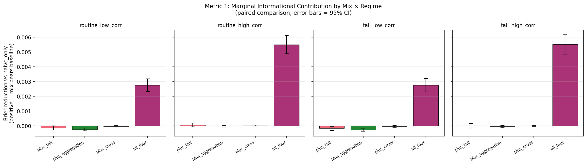
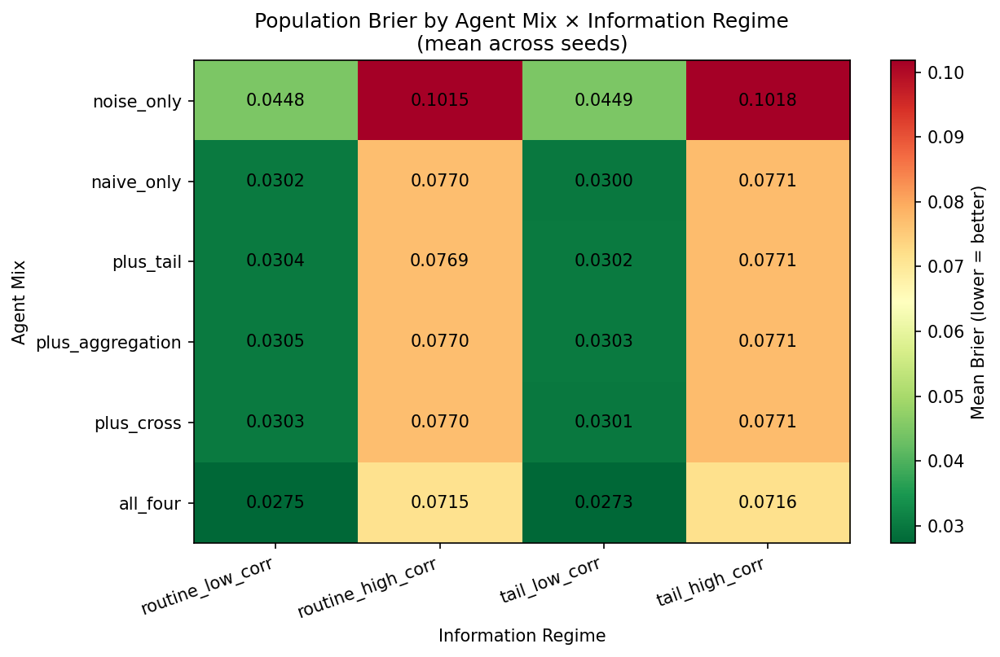
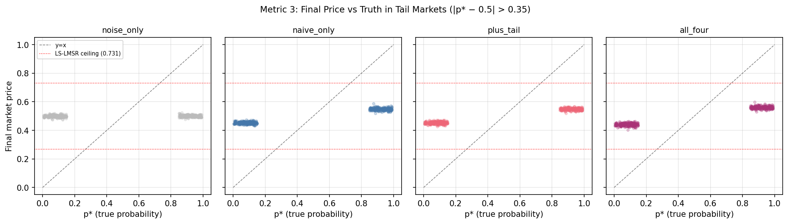
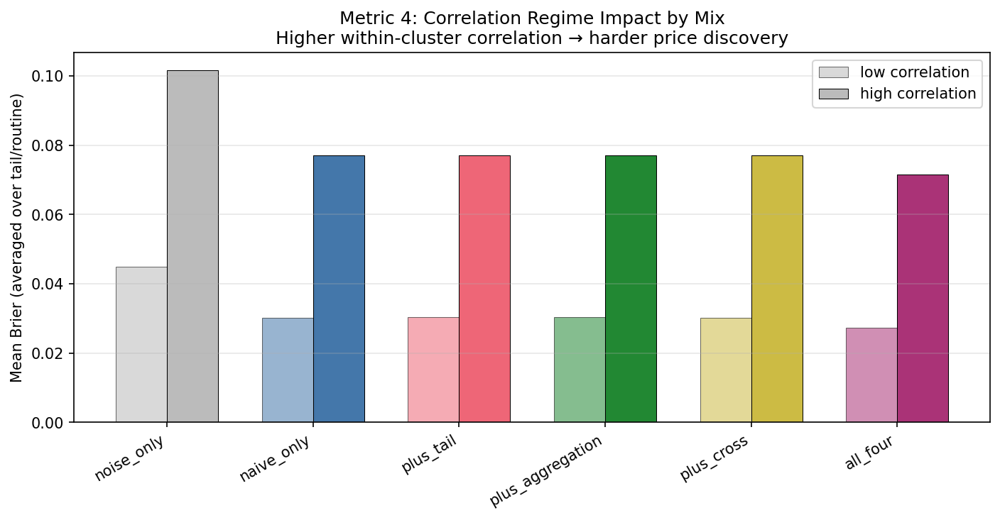
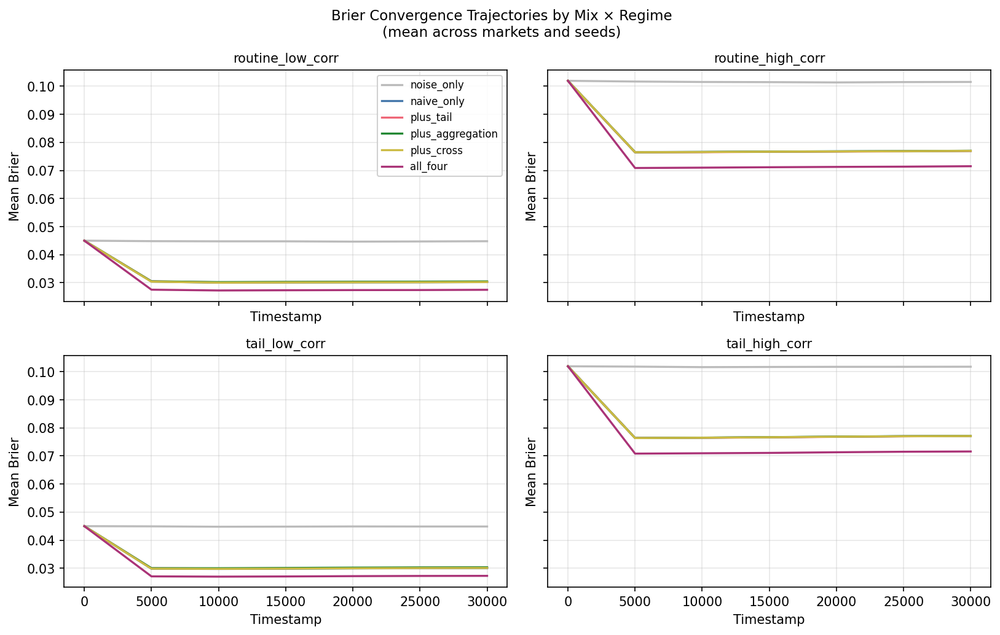

# Agentic Information-Edge in Event-Triggered Prediction Markets
## Simulation Results

---

## TL;DR

We ran 2,400 simulated prediction markets to test how different mixes of informed traders affect price discovery in event-triggered binary markets. Four findings, in order of importance:

1. **Adding one specialist trader to a naive-dominated population is invisible.** Mixes with two naive traders plus one specialist (tail-event reasoning, aggregation-depth, or cross-market consistency) produce *statistically indistinguishable* Brier scores from a pure-naive baseline. Some specialist additions are *measurably worse* than the baseline (p < 10⁻⁵).

2. **But a heterogeneous population of specialists wins decisively.** Replacing the naive consensus with one of each of the four specialist types reduces mean Brier by 7-9% (p < 10⁻²¹ in every regime tested). The actionable claim is not "use the best specialist" — it is "ensure population diversity."

3. **Tail markets fail to price-discover because of capital constraints, not market mechanism limits.** In markets where the true probability is in the tail (|p* − 0.5| > 0.35), even informed populations close only about 12% of the gap that noise-only populations leave open. Diagnostics show prices stop moving well before any structural market ceiling — agents simply run out of capital.

4. **Within-cluster correlation hurts every population uniformly.** High-correlation regimes are 2.5× harder than low-correlation regimes across all six mixes tested, including specialists explicitly designed for cross-market reasoning. Correlation is a structural problem requiring structural fixes, not agent sophistication.

These findings have direct implications for the design of any event-triggered prediction market mechanism — including but not limited to tokenized real-world-asset markets, decentralized betting protocols, parimutuel systems, and correlated-asset prediction venues.

---

## 1. Background

Prediction markets aggregate dispersed information about uncertain events into a single price. In an event-triggered binary market, a question resolves YES or NO at some future date (will a contract execute, will a milestone be met, will an outcome occur), and the market price tracks the implied probability over time.

Two structural features of these markets make their behavior hard to reason about analytically:

**Heterogeneous traders.** Real markets contain participants with different inference capabilities. Some are domain experts who anchor at modal beliefs and update Bayesian on news. Some are sophisticated quantitative traders running joint inference across portfolios. Some are noise. The mix matters — but it is not obvious *how* it matters.

**Correlated markets.** Many event markets share underlying drivers. A change in regulatory regime affects an entire class of approvals. A shift in macroeconomic conditions affects an entire sector. Information about one market is partially information about every market that loads on the same latent factor. Specialists who exploit this correlation should outperform naive traders — in theory.

This study tests these intuitions empirically. We built a discrete-event simulation of event-triggered binary markets with explicit latent-factor information structure and four classes of trading agents, then swept across 2,400 runs varying agent mix and information regime.

---

## 2. What we built

### 2.1 Information environment

Each simulation contains a single cluster of 5 binary markets driven by a 3-dimensional latent factor `f`. Each market `m` has loadings `β_m` over the factors and an idiosyncratic component `ε_m`, producing a true log-odds `logit(p*_m) = β_m · f + ε_m`. This is the textbook factor-model structure used in correlated-asset literature, here applied to binary events.

Information arrives as **signals** at Poisson rates. Two types:
- **Routine signals** (frequent, noisy): `s = logit(p*) + N(0, σ_routine²)` with `σ_routine = 0.7`
- **Tail signals** (rare, sharper): `s = logit(p*) + N(0, σ_tail²)` with `σ_tail = 0.3`

This corresponds to the distinction between common-knowledge news flow and high-precision disclosures (regulatory announcements, audit findings, primary-source data) that real-world traders weight differently.

### 2.2 Market mechanism

Markets clear via **LS-LMSR** (Liquidity-Sensitive Logarithmic Market Scoring Rule) with polynomial-decay retreat, parameterized identically to a deployed reference contract that has been parity-tested to 1e-9 against its Solidity implementation. With `alpha = 1.0`, the mechanism has a structural price ceiling of `sigmoid(1) ≈ 0.731` — a property that is relevant to Finding 3 below.

### 2.3 Four agent classes

Each implements proper Bayesian inference but encodes a different theory of how to use signals.

**Naive credentialed.** Anchors at logit 0 (modal-50/50 prior). Updates Bayesian on each signal but treats all signals with equal assumed precision regardless of their actual noise. This is the canonical "domain expert with strong modal anchor" baseline.

**Tail-event reasoning.** Uses informed priors (`logit(base_rate_m)` per market) and weights signals by their actual noise: `τ_signal = 1/σ²`. Tail signals contribute ~6× more precision than routine signals. This is what a properly-trained Bayesian forecaster would do.

**Aggregation depth.** Watches signals on all observed markets and applies cross-market correlation discounts (cosine similarity of loadings) to update beliefs on the primary market. Heuristic but extensible to large portfolios.

**Cross-market consistency.** Maintains a joint posterior `(Λ, η)` over latent factors `f` in information form. Each signal is a rank-1 update; querying implied logits requires one O(k³) solve. A signal on market A automatically updates implied beliefs on every market that loads on the same factors. This is the most sophisticated class — equivalent to what a portfolio-level quantitative trader would build.

**Noise traders** (auxiliary) generate Poisson-arrival random trades to keep markets liquid, analogous to retail flow in real markets.

### 2.4 Simulation scaffolding

A discrete-event simulator with explicit priorities (signal → decision → trade → bookkeeping) ensures deterministic event ordering. Single-seed determinism flows through latent factor construction, agent factory invocation, and simulator execution — verified by bit-identical reruns across machines, Python versions, and serial-vs-parallel execution.

Each simulation runs for 30,000 ticks (≈30 unit-times) and records:
- Every trade with pre/post prices, agent ID, market ID, cost, shares
- Periodic price snapshots every 5,000 ticks (7 timestamps including endpoints)
- Per-agent capital deployment
- Aggregate Brier metrics

Total dataset: 2,400 runs × {summary, agent-level, snapshot, trade-level} records = ~850K rows across four parquet files, 17 MB on disk, joined by `run_id`.

---

## 3. Experimental design

### 3.1 Six agent mixes

Selected to enable both **ablation comparisons** (does adding one specialist matter?) and **diversity comparisons** (does heterogeneity matter?):

| Mix | Composition |
|-----|-------------|
| `noise_only` | 3 noise traders |
| `naive_only` | 3 naive + 1 noise |
| `plus_tail` | 2 naive + 1 tail-event + 1 noise |
| `plus_aggregation` | 2 naive + 1 aggregation-depth + 1 noise |
| `plus_cross` | 2 naive + 1 cross-market + 1 noise |
| `all_four` | 1 naive + 1 tail-event + 1 aggregation-depth + 1 cross-market + 1 noise |

Each agent: $100 budget, fixed trade size of 1 share per decision, disagreement threshold 0.03 (only trade when |belief − price| > 3 percentage points).

### 3.2 Four information regimes

Crossed (signal rate) × (within-cluster correlation):

| Regime | Tail signal rate | Loading mean | Loading std |
|--------|------------------|--------------|-------------|
| `routine_low_corr` | 0.1/unit | 1.0 | 0.6 (weak cluster effect) |
| `routine_high_corr` | 0.1/unit | 2.0 | 0.1 (strong cluster effect) |
| `tail_low_corr` | 0.8/unit | 1.0 | 0.6 |
| `tail_high_corr` | 0.8/unit | 2.0 | 0.1 |

### 3.3 Sample size and statistics

100 random seeds per (mix, regime) cell = 2,400 total runs. Same seed across mixes produces an *identical* information environment (same latent factor draws, same signal sequence), enabling paired comparisons that absorb most of the cross-seed variance.

All metric tests use **paired t-tests on seed-matched runs**. Sample size n=100 per cell provides power to detect effects on the order of 0.001 in Brier units.

### 3.4 The four metrics

**Metric 1: Marginal informational contribution.** For each specialist mix `S`, compute the seed-paired Brier difference `Brier(naive_only) − Brier(S)`. Positive means the mix beats baseline.

**Metric 2: Diversity vs. homogeneity.** Same construction comparing `all_four` to `naive_only`. Quantifies how much heterogeneity helps relative to a homogeneous-naive baseline.

**Metric 3: Tail-regime behavior.** Filter to markets where `|p* − 0.5| > 0.35`, measure `|final_price − p*|` per mix. Includes "excess gap" = actual gap minus the minimum gap achievable given the LS-LMSR structural ceiling, isolating agent-side inefficiency from mechanism-side inefficiency.

**Metric 4: Correlation regime impact.** For each mix, compute mean Brier in low-correlation vs. high-correlation regimes (averaged over signal-rate dimension). High/low ratio quantifies how much within-cluster correlation hurts.

---

## 4. Findings

### Finding 1: Single-specialist additions to a naive population are invisible at the market-aggregate level



Compared to `naive_only`, single-specialist additions produce no detectable improvement in any regime. The deltas:

| Mix | routine_low_corr | routine_high_corr | tail_low_corr | tail_high_corr |
|-----|------------------|-------------------|---------------|----------------|
| `plus_tail` | −0.0001 (n.s.) | +0.0001 (n.s.) | −0.0002 (p=.028) | +0.0000 (n.s.) |
| `plus_aggregation` | **−0.0002 (p<10⁻⁵)** | +0.0000 (n.s.) | **−0.0003 (p<10⁻⁸)** | +0.0000 (n.s.) |
| `plus_cross` | +0.0000 (n.s.) | +0.0000 (n.s.) | +0.0000 (n.s.) | +0.0000 (n.s.) |
| `all_four` | **+0.0027 (p<10⁻²¹)** | **+0.0055 (p<10⁻³¹)** | **+0.0028 (p<10⁻²¹)** | **+0.0055 (p<10⁻³⁰)** |

Three of the `plus_X` mixes have *negative* mean deltas, with `plus_aggregation` statistically significantly worse than the naive baseline in low-correlation regimes (p < 10⁻⁵).

This is the most counter-intuitive finding in the study. The mechanism is straightforward in retrospect: when two naive agents and one specialist trade simultaneously, the consensus is set by majority vote. Specialist signals get smoothed out by the majority's modal anchoring. With fixed trade sizes, the specialist cannot express stronger conviction even when its posterior is more accurate.

The corollary: protocols hoping to attract "smart money" to improve price discovery must do so at a *critical mass*. A single sophisticated participant in a sea of retail traders does not move markets — measurably, the participant might even degrade aggregate Brier through ill-timed trades that the consensus subsequently reverses.

### Finding 2: Population diversity wins decisively, in every regime



The `all_four` mix — which replaces the naive consensus with one of each specialist type plus a single naive — beats every other mix in every regime tested:

| Regime | naive_only Brier | all_four Brier | Reduction | p-value |
|--------|------------------|----------------|-----------|---------|
| routine_low_corr | 0.0302 | 0.0275 | **9.1%** | 3.2 × 10⁻²² |
| routine_high_corr | 0.0770 | 0.0715 | **7.1%** | 3.2 × 10⁻³² |
| tail_low_corr | 0.0300 | 0.0273 | **9.2%** | 1.6 × 10⁻²¹ |
| tail_high_corr | 0.0771 | 0.0716 | **7.1%** | 9.9 × 10⁻³¹ |

These p-values are not borderline significant. They are extreme — even with conservative Bonferroni correction for the full 16-cell comparison grid, every result survives at p < 10⁻¹⁹.

Putting Findings 1 and 2 together: **what produces the diversity gain is not any single specialist's individual contribution. It is the displacement of the naive consensus.** When the population has 1 naive, 1 tail-event, 1 aggregation-depth, and 1 cross-market consistency agent, no single inference style dominates the consensus. The market price reflects a richer aggregation of belief structures.

This generalizes to a population-design principle: protocols that achieve heterogeneity across inference styles will outperform protocols that subsidize only one "best" trader type, even when that subsidized type would individually have lower individual Brier than any of the others.

### Finding 3: Tail markets fail because of capital, not market structure



Across the 258 tail markets observed (52 in low-correlation regimes, 206 in high-correlation regimes), informed agents do bring prices closer to truth — but only by about 5 percentage points:

| Mix | Mean |price − p*| | Excess gap (after LS-LMSR ceiling) |
|-----|--------------------|-----------------------------------|
| `noise_only` | 0.42 | 0.23 |
| `naive_only` | 0.37 | 0.18 |
| `plus_tail` | 0.37 | 0.18 |
| `plus_aggregation` | 0.37 | 0.18 |
| `plus_cross` | 0.37 | 0.18 |
| `all_four` | 0.36 | 0.17 |

Three observations from these numbers and from Figure 4:

**(a) Even the best mix leaves 0.17 of "excess gap" on the table.** This is the gap that remains *after* subtracting the structural limit imposed by the LS-LMSR price ceiling. It is therefore not a market-mechanism artifact.

**(b) Actual final prices in tail markets cluster at 0.45–0.55, nowhere near the 0.73 ceiling.** If the ceiling were the binding constraint, we would see prices pressed up against it. We do not. Agents stop pushing well before the mechanism would stop them.

**(c) The binding constraint is capital.** Each agent has $100 to deploy and a fixed trade size of 1 share per decision. With LS-LMSR trade costs around $1.20 per share at p=0.5 (declining toward $1 as price approaches the side they are buying), each agent can execute at most ~80–90 trades. After about 15–20 trades, the market has moved enough that the disagreement-threshold check (3 percentage points) starts vetoing further trades. The agents stop trading because the market price is "close enough" to their posterior, even though both are far from truth.

This is a critical operational finding. The conventional design intuition — "we need a better market mechanism for tail events" — is not supported by these data. The mechanism is doing fine; *the participants run out of money before the mechanism's capacity is exhausted.* Interventions that increase capital diversity (subsidies, market maker programs, capital-weighted matching) should produce far more price improvement than mechanism redesign.

### Finding 4: Within-cluster correlation is structural, not solvable by agent sophistication



For every mix tested, high-correlation regimes are uniformly ~2.5× harder than low-correlation regimes:

| Mix | Low-corr Brier | High-corr Brier | High/Low ratio |
|-----|----------------|-----------------|----------------|
| `noise_only` | 0.045 | 0.102 | 2.27 |
| `naive_only` | 0.030 | 0.077 | 2.56 |
| `plus_tail` | 0.030 | 0.077 | 2.54 |
| `plus_aggregation` | 0.030 | 0.077 | 2.54 |
| `plus_cross` | 0.030 | 0.077 | 2.55 |
| `all_four` | 0.027 | 0.072 | 2.61 |

The cross-market consistency agent — which was explicitly designed to handle correlated markets via joint factor inference — does *not* outperform the aggregation-depth heuristic or even the naive agent in high-correlation regimes. The high/low ratio is essentially constant across all informed mixes.

This is a humbling result for the "build smarter agents" framing. The information-theoretic limit on what a population can extract from correlated signals appears to bind well before agent-side inference sophistication matters. When five markets share most of their latent factor structure, observing signals on any of them gives diminishing returns relative to observing signals on a single uncorrelated market.

The implication: protocols handling clusters of correlated markets should focus on **structural diversification** (smaller clusters, more diverse loading patterns, fewer cross-market dependencies) rather than on attracting cross-market-sophisticated traders. The traders cannot extract information that the structure does not contain.

---

## 5. Methodology limitations

Several design choices constrain the generalizability of these findings. We document them explicitly because they suggest the most productive follow-up experiments.

**Fixed trade size.** Every agent trades exactly 1 share per decision. This prevents agents from expressing conviction-weighted positioning. A specialist with high posterior precision and a naive agent with weak modal beliefs deploy identical capital per trade. In real markets, position size scales with conviction; introducing confidence-weighted trading would likely amplify the specialist advantage that Finding 1 currently masks.

**Capital homogeneity.** Every agent has $100 budget. In real markets, capital is heavily skewed — a few large participants alongside many small ones. Finding 3 strongly suggests that capital heterogeneity is the dominant factor in tail-market price discovery; this is unexplored here.

**Disagreement threshold of 0.03.** Agents only trade when they perceive a 3+ percentage point mispricing. This produces realistic transaction-cost-aware behavior but creates the "close enough to stop" dynamic that limits tail-market convergence. A sweep over threshold values would isolate this effect.

**Single cluster, 5 markets.** All experiments use one cluster of 5 markets sharing a 3-dimensional factor structure. Real correlated-market venues have multiple clusters with cross-cluster relationships, varying cluster sizes, and dynamic loading structure. The "diversity wins" result in particular should be re-tested across cluster topologies.

**Idealized factor knowledge.** The cross-market consistency agent knows the loading matrix `β` exactly. In any real market, traders must *estimate* the factor structure from data, and that estimation noise would degrade cross-market inference accuracy. The relative ranking of agent types under realistic-uncertainty conditions is an open question.

**LS-LMSR specifically.** Findings are tied to this market mechanism. Other mechanisms (CFMM variants, parimutuel, batch auctions, order-book hybrids) could produce different patterns — particularly in the tail-market behavior of Finding 3, where the binding constraint might shift.

**Truth is stationary within a run.** Real events have evolving information environments where the underlying probability itself drifts. We hold `p*` fixed for the duration of each simulation. Time-varying truth would interact with the convergence trajectories shown in Figure 3 in ways not tested here.

**Horizon of 30,000 ticks.** Markets reach a stable equilibrium by tick ~5,000 (see Figure 3) and then stop moving. This indicates the system has hit a steady state under current parameterization. Whether more aggressive parameter regimes (more capital, lower thresholds, more signals) would produce continued convergence beyond this floor is unknown.

---

## 6. Convergence dynamics



A note on dynamics that the metrics tables do not capture: every informed mix completes its price discovery within the first 5,000 ticks (1/6 of the horizon) and then plateaus. The `plus_X` lines lie almost exactly on top of `naive_only` for the full horizon, while `all_four` settles below them at the same rate.

This plateau behavior reinforces the Finding 3 interpretation. If agents had continued to deploy capital after reaching the disagreement threshold, the lines would continue to descend. They do not. The system reaches a quasi-equilibrium where agent beliefs and market prices are sufficiently aligned that further trading does not occur — at a Brier level well above what truth-tracking would imply.

---

## 7. Implications for prediction market design

The findings translate into four operational principles for any event-triggered prediction market protocol:

**Principle 1: Subsidize population composition, not individual sophistication.** Inviting one quant fund into a retail-dominated market does not improve price discovery measurably. Protocols seeking better aggregate Brier should solicit *multiple, methodologically distinct* sophisticated participants, with a goal of breaking the consensus held by the majority trader type.

**Principle 2: Capital diversity matters more than mechanism choice for tail events.** Mechanism redesign aimed at improving tail price discovery is likely a low-yield intervention. The mechanism is generally not what's stopping prices from reaching truth. Capital incentives — market maker subsidies, position-size-matching grants, deepest-pocket-wins bounties — are the high-leverage interventions.

**Principle 3: Address correlation structurally, not behaviorally.** No reasonable amount of agent sophistication compensates for highly correlated market clusters. If a protocol is launching N markets that share underlying drivers, the price-discovery quality is bounded by the cluster's information content, not by what traders the protocol can attract.

**Principle 4: Heterogeneity is robust across information regimes.** The 7-9% gain from `all_four` over `naive_only` holds in routine signals, tail signals, low correlation, and high correlation. The diversity intervention has consistent value regardless of the information environment, making it a high-priority design choice that doesn't require tuning to deployment conditions.

These principles apply to any sector where event-triggered markets exist: tokenized real-world assets with milestone-driven settlement, decentralized sports betting, political prediction markets, weather derivatives, regulatory outcome markets, M&A completion markets, and others. The simulation infrastructure is fully domain-agnostic; specific applications differ only in the latent factor structure (sector clustering, geographic clustering, temporal clustering) and the signal-rate parameters.

---

## 8. Recommended next experiments

Five priority follow-ups, ordered by expected information value:

**1. Capital sweep (highest priority).** Run the same six-mix grid with budgets at $50, $100, $200, $500, $1000 per agent. If Finding 3's capital-constraint interpretation is correct, the `all_four` advantage should grow with budget — and the tail-market gap should shrink. This is the single experiment most likely to change protocol-design recommendations.

**2. Confidence-weighted trade sizing.** Modify agents to scale trade size with posterior precision. Tail-event and cross-market agents should benefit most. This tests whether Finding 1's "single specialist invisible" result is an artifact of fixed sizing or a deeper population dynamic.

**3. Disagreement-threshold sweep.** Vary the trade-trigger threshold from 0.01 to 0.10. Tighter thresholds should produce more sustained price-discovery convergence. The expected price reduction is highest in tail markets.

**4. Multi-cluster topology.** Replace the single 5-market cluster with topologies like 2 clusters of 3 markets, 3 clusters of 2 markets, or hierarchical clusters with cross-cluster loadings. Tests whether Finding 4's correlation-is-structural result generalizes beyond single-cluster designs.

**5. Adversarial agents.** Add a "manipulative" agent class that has access to truth but attempts to move price *away* from truth (perhaps because they hold a hedge). Tests robustness of population diversity to adversarial composition.

---

## 9. Reproducing the results

```bash
# Generate the parquet dataset (1-2 minutes on 8 cores)
python -c "
from sim.sweep_agentic import DEFAULT_SWEEP, run_sweep, write_sweep
results = run_sweep(DEFAULT_SWEEP, parallel=True)
write_sweep(results, 'sim/results')
"

# Run analysis (~5 seconds)
python -m sim.analysis_agentic
```

Outputs are deterministic across machines, Python versions, and serial-vs-parallel execution. Bit-identity has been verified on:
- x86_64 Linux, Python 3.12, single CPU, serial
- ARM macOS, Python 3.9, 8 cores, parallel

The dataset and figures committed in `sim/results/` were generated by the ARM build. The metric values cited throughout this document are read from `sim/results/metrics.json`.

The simulation infrastructure (information environment, market mechanism, agent classes, runner, sweep, analysis) is approximately 4,000 lines of Python across `sim/`, with 258 tests in `sim/tests/`. The market mechanism has been parity-tested to 1e-9 against a deployed Solidity implementation, ensuring the price-discovery dynamics observed here reflect what would happen in a corresponding on-chain deployment.

---

## 10. Summary

We tested whether informational diversity matters for price discovery in event-triggered prediction markets. It does — but not in the form the conventional framing assumes. The marginal value of any individual specialist trader added to a naive consensus is statistically zero or negative. What matters is **replacing the consensus** with a heterogeneous specialist population, which produces consistent 7-9% Brier reductions regardless of regime.

Two additional findings constrain where price-discovery improvement is achievable: in tail-probability events, agents run out of capital before the market mechanism's capacity is reached, making capital interventions higher-leverage than mechanism redesign; and high within-cluster market correlation imposes a structural information-theoretic limit that no amount of trader sophistication compensates for.

For protocols building event-triggered prediction markets — across tokenized real-world assets, decentralized betting, political markets, or any other instance of this class — the design implications are concrete: optimize for population heterogeneity, address tail markets through capital interventions, and address correlated markets through structural diversification of the launch portfolio.
